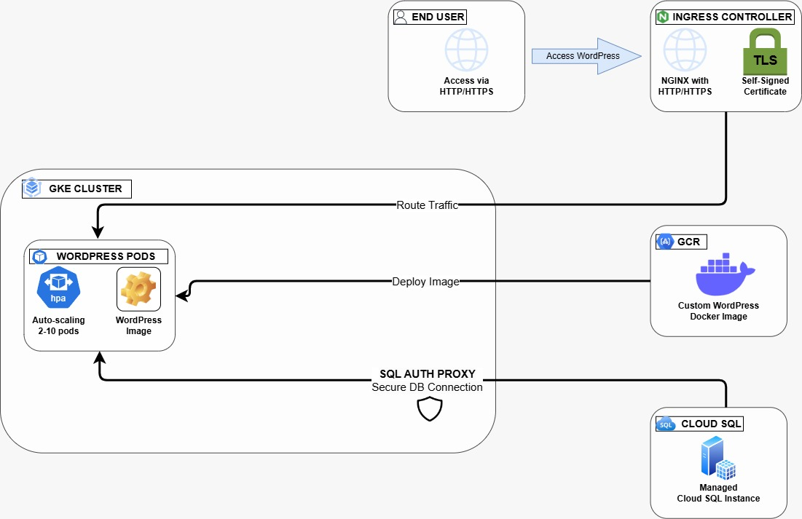

# WordPress on GKE with Auto-Scaling and Cloud SQL Integration

## Project Overview

This project deploys a WordPress website on **Google Kubernetes Engine (GKE)** with the following features:
1. **Auto-scaling** between 2 and 10 WordPress pods based on CPU usage.
2. **Ingress** for HTTP and HTTPS access, using NGINX and a self-signed certificate.
3. **Cloud SQL (MySQL)** for database management.
4. **Custom WordPress Image** stored in Google Container Registry (GCR), pre-configured with a theme and plugins for consistent deployment.

## Architecture

- **GKE Cluster**: Hosts WordPress pods that scale based on CPU usage.
- **NGINX Ingress**: Handles HTTP and HTTPS traffic with TLS configuration for secure access.
- **Cloud SQL**: Provides a managed MySQL instance for WordPress.
- **Custom WordPress Image**: A Docker image stored in GCR, containing pre-installed themes and plugins.

  

## Prerequisites

- [Google Cloud SDK](https://cloud.google.com/sdk) installed and configured.
- Google Cloud project with billing enabled.
- `terraform` and `kubectl` installed.

---

## Setup Guide

## Setup and Configuration

### Step 1: Configure GKE Cluster and Node Pool
1. **Provision GKE Cluster**:
- Use Terraform to create a GKE cluster with **e2-medium** machine types and **HTTP Load Balancing** enabled.
- The cluster runs WordPress with initial node capacity and supports scaling.

2. **Node Pool Configuration**:
- A separate node pool is set up for running the WordPress pods with auto-scaling configurations.

### Step 2: Deploy WordPress on GKE with Auto-Scaling
1. **Deployment Configuration**:
- WordPress is deployed from a **custum image stored in GCR** as a Kubernetes deployment with CPU limits and requests defined to allow scaling.
- Environment variables (`WORDPRESS_DB_HOST`, `WORDPRESS_DB_USER`, `WORDPRESS_DB_PASSWORD`, and `WORDPRESS_DB_NAME`) are configured to connect with Cloud SQL.
   
2. **Horizontal Pod Autoscaler (HPA)**:
- An HPA resource is defined to monitor CPU usage and scale the pods from 2 to 10 based on utilization, allowing the application to handle increased traffic effectively.

### Step 3: Set Up Cloud SQL and Cloud SQL Auth Proxy
1. **Cloud SQL Instance**:
- A MySQL instance on Cloud SQL is created using Terraform with `db-f1-micro` as the instance type. The `wordpress_db` database and `wordpress` user with a strong password are created.

2. **Secure Connectivity**:
- **Cloud SQL Auth Proxy** is deployed as a sidecar container in each WordPress pod to securely manage database connections using the service account with `Cloud SQL Client` permissions.
- Database credentials are securely stored as Kubernetes secrets.

### Step 4: Configure Ingress with HTTP and HTTPS
1. **Create Self-Signed SSL Certificate**:
- A self-signed SSL certificate is generated using `openssl` and stored as a Kubernetes TLS secret.

2. **Ingress Resource**:
- An NGINX Ingress controller is used to expose the WordPress service. The Ingress routes both HTTP and HTTPS traffic, using the self-signed certificate for HTTPS.

3. **WordPress Proxy Configuration**:
- `wp-config.php` is updated to recognize HTTPS when behind a proxy. This enables WordPress to work seamlessly over HTTPS without redirect issues.

---

## Validation and Testing

1. **Check Autoscaling**:
   - Use `kubectl get hpa` to monitor CPU-based scaling and confirm pods scale between 2 to 10 replicas based on load.

2. **Access WordPress**:
   - Visit the external IP or domain assigned by Ingress on both `http://` and `https://` to verify accessibility.
   - Proceed past self-signed SSL warnings for HTTPS.

3. **Verify Database Connectivity**:
   - Access WordPress and create sample posts to ensure data is saved to Cloud SQL. Use the Google Cloud Console to inspect Cloud SQL tables or run SQL queries.

---

